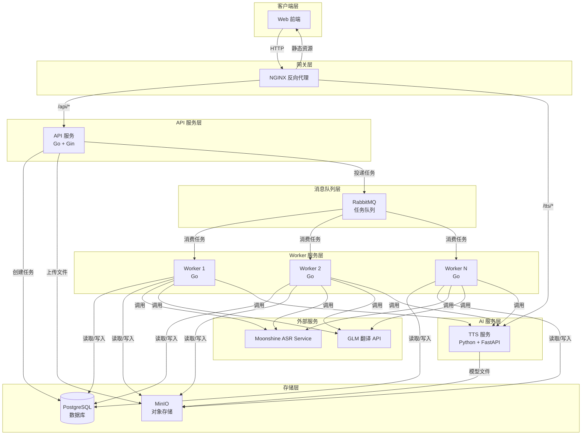
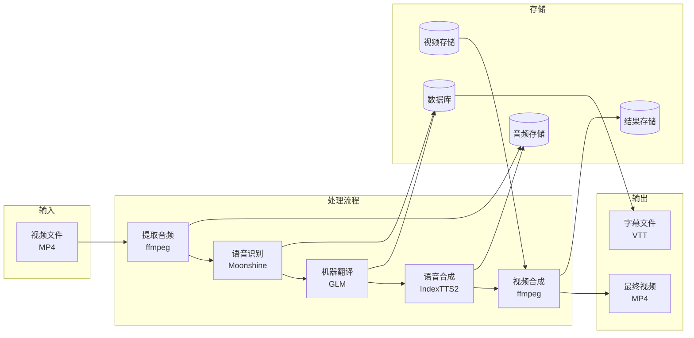
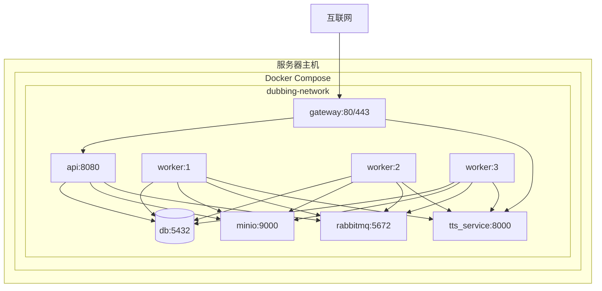
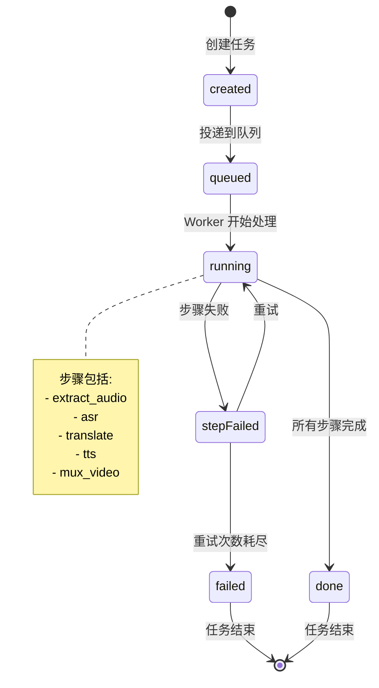

# 架构补充图示

> 更新日期：2026-01-03｜适用版本：main 分支

本文件提供系统架构的补充可视化图示。完整的文字说明与权威流程示意请参见 `architecture.md`。

## 整体架构图

```mermaid
graph TB
    subgraph Client["客户端层"]
        Web[Web 前端]
    end

    subgraph Gateway["网关层"]
        NGINX[NGINX 反向代理]
    end

    subgraph API["API 服务层"]
        API_Service[API 服务<br/>Go + Gin]
    end

    subgraph Queue["消息队列层"]
        RabbitMQ[RabbitMQ<br/>任务队列]
    end

    subgraph Worker["Worker 服务层"]
        Worker1[Worker 1<br/>Go]
        Worker2[Worker 2<br/>Go]
        WorkerN[Worker N<br/>Go]
    end

    subgraph AI["AI 服务层"]
        TTS_Service[TTS 服务<br/>Python + FastAPI]
    end

    subgraph External["外部服务"]
        MoonshineASR[Moonshine ASR Service]
        GLM_API[GLM 翻译 API]
    end

    subgraph Storage["存储层"]
        PostgreSQL[(PostgreSQL<br/>数据库)]
        MinIO[MinIO<br/>对象存储]
    end

    Web -->|HTTP| NGINX
    NGINX -->|/api/*| API_Service
    NGINX -->|/tts/*| TTS_Service
    NGINX -->|静态资源| Web

    API_Service -->|创建任务| PostgreSQL
    API_Service -->|上传文件| MinIO
    API_Service -->|投递任务| RabbitMQ

    RabbitMQ -->|消费任务| Worker1
    RabbitMQ -->|消费任务| Worker2
    RabbitMQ -->|消费任务| WorkerN

    Worker1 -->|读取/写入| PostgreSQL
    Worker1 -->|读取/写入| MinIO
    Worker1 -->|调用| MoonshineASR
    Worker1 -->|调用| GLM_API
    Worker1 -->|调用| TTS_Service

    Worker2 -->|读取/写入| PostgreSQL
    Worker2 -->|读取/写入| MinIO
    Worker2 -->|调用| MoonshineASR
    Worker2 -->|调用| GLM_API
    Worker2 -->|调用| TTS_Service

    WorkerN -->|读取/写入| PostgreSQL
    WorkerN -->|读取/写入| MinIO
    WorkerN -->|调用| MoonshineASR
    WorkerN -->|调用| GLM_API
    WorkerN -->|调用| TTS_Service

    TTS_Service -->|模型文件| MinIO
```

## 数据流图

```mermaid
flowchart LR
    subgraph Input["输入"]
        Video[视频文件<br/>MP4]
    end

    subgraph Processing["处理流程"]
        Extract[提取音频<br/>ffmpeg]
        ASR_Step[语音识别<br/>Moonshine]
        Translate_Step[机器翻译<br/>GLM]
        TTS_Step[语音合成<br/>IndexTTS2]
        Mux[视频合成<br/>ffmpeg]
    end

    subgraph Storage["存储"]
        Video_Storage[(视频存储)]
        Audio_Storage[(音频存储)]
        Result_Storage[(结果存储)]
        DB[(数据库)]
    end

    subgraph Output["输出"]
        Final_Video[最终视频<br/>MP4]
        Subtitle[字幕文件<br/>VTT]
    end

    Video --> Extract
    Extract --> Audio_Storage
    Extract --> ASR_Step
    ASR_Step --> DB
    ASR_Step --> Translate_Step
    Translate_Step --> DB
    Translate_Step --> TTS_Step
    TTS_Step --> Audio_Storage
    TTS_Step --> Mux
    Video_Storage --> Mux
    Mux --> Result_Storage
    Mux --> Final_Video
    DB --> Subtitle
```

## 服务部署拓扑

```mermaid
graph TB
    subgraph Host["服务器主机"]
        subgraph Docker["Docker Compose"]
            subgraph Network["dubbing-network"]
                Gateway[gateway:80/443]
                API[api:8080]
                Worker1[worker:1]
                Worker2[worker:2]
                Worker3[worker:3]
                TTS[tts_service:8000]
                DB[(db:5432)]
                MinIO[minio:9000]
                RabbitMQ[rabbitmq:5672]
            end
        end
    end

    Internet[互联网] --> Gateway
    Gateway --> API
    Gateway --> TTS
    API --> DB
    API --> MinIO
    API --> RabbitMQ
    Worker1 --> DB
    Worker1 --> MinIO
    Worker1 --> RabbitMQ
    Worker1 --> TTS
    Worker2 --> DB
    Worker2 --> MinIO
    Worker2 --> RabbitMQ
    Worker2 --> TTS
    Worker3 --> DB
    Worker3 --> MinIO
    Worker3 --> RabbitMQ
    Worker3 --> TTS
```

## 任务状态机

```mermaid
stateDiagram-v2
    [*] --> created: 创建任务
    created --> queued: 投递到队列
    queued --> running: Worker 开始处理
    running --> stepFailed: 步骤失败
    stepFailed --> running: 重试
    stepFailed --> failed: 重试次数耗尽
    running --> done: 所有步骤完成
    failed --> [*]: 任务结束
    done --> [*]: 任务结束

    note right of running
        步骤包括:
        - extract_audio
        - asr
        - translate
        - tts
        - mux_video
    end note
```
