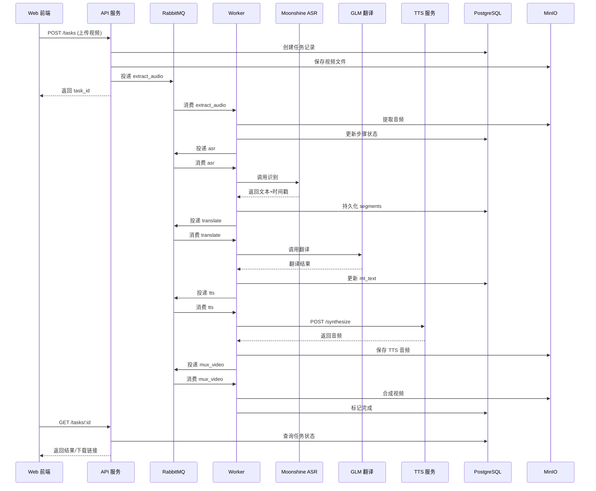

# 系统架构设计文档

## 1. 服务边界与队列选型

### 1.1 队列选型：RabbitMQ

**选择理由：**
- 支持复杂的路由规则（routing key、exchange、queue binding）
- 内置死信队列（DLQ）和延迟重试机制
- 消息持久化保证可靠性
- 适合任务依赖链式处理
- 社区成熟，文档丰富

**替代方案 NATS 的劣势：**
- 路由能力相对简单，不适合复杂的任务编排
- 延迟队列需要额外实现

### 1.2 服务边界划分

#### 1.2.1 API 服务（api/）
**职责：**
- 对外提供 REST API
- 接收文件上传
- 创建任务记录
- 查询任务状态和结果
- 提供下载链接

**技术栈：** Go + Gin/Echo

#### 1.2.2 编排服务（orchestrator/）
**决策：与 API 服务合并，但以独立包存在**

**现状与职责边界：**
- `api/internal/orchestrator` 暴露 `TaskOrchestrator`、`QueuePublisher`、`TaskRepository` 接口，默认实现 `DefaultTaskOrchestrator`
- API 层只负责入参校验、文件上传、持久化初始任务记录，再通过接口调用 orchestrator 启动状态机
- Orchestrator 负责任务状态机入口、步骤依赖与消息投递（当前第一跳为 `extract_audio`），并通过 `TaskRepository` 更新任务状态
- 通过接口解耦后，可将 orchestrator 抽离为独立进程或扩展更多状态（重试、暂停、取消）而无需修改 API handler

**后续可拆分路径：**
- 替换 `QueuePublisher` 实现为 RPC/HTTP 客户端，将编排逻辑迁移到独立服务
- 扩展 `TaskRepository` 接口以支持乐观锁、审计日志等高级特性

#### 1.2.3 Worker 服务（worker/）
**职责：**
- 消费队列任务
- 执行具体处理步骤
- 更新任务状态和进度
- 处理失败重试

**步骤拆分粒度：**
- `extract_audio`: 提取音频（ffmpeg）
- `asr`: 语音识别（Moonshine ASR 服务）
- `translate`: 机器翻译（GLM API）
- `tts`: 语音合成（调用 tts_service）
- `mux_video`: 视频合成（ffmpeg）

**技术栈：** Go + RabbitMQ client

#### 1.2.4 TTS 服务（tts_service/）
**职责：**
- 通过 ModelScope API 调用 IndexTTS-2 模型进行语音合成
- 接收文本和时间轴约束参数
- 返回合成音频
- 作为适配层，封装 ModelScope API 调用细节

**技术栈：** Python + FastAPI + uv + ModelScope SDK

### 1.3 服务通信方式

本文件阐述视频本地化自动配音系统的核心架构、服务边界与任务处理流程。补充图示（整体架构、数据流、部署拓扑、状态机）请参见 `architecture-diagram.md`。

## 1. 架构概览

- **模式**：微服务 + 异步任务队列
- **语言与框架**：Go（API/Worker），Python（TTS），FastAPI + uv（TTS 服务），RabbitMQ（消息队列），PostgreSQL + MinIO（数据与对象存储）
- **部署**：Docker Compose 编排，可横向扩展 Worker 实例

## 2. 服务边界与职责

### 2.1 API 服务（`api/`）
- 提供 REST API（上传、任务查询、下载）
- 管理任务状态机与编排逻辑（创建任务、投递队列、记录依赖）
- 负责鉴权与基础输入校验

### 2.2 Worker 服务（`worker/`）
- 消费 RabbitMQ 队列，执行离线/异步任务
- 典型步骤：`extract_audio` → `asr` → `translate` → `tts` → `mux_video`
- 负责步骤级重试、失败回退与进度上报

### 2.3 TTS 服务（`tts_service/`）
- 通过 ModelScope API 调用 IndexTTS-2 进行受时间轴约束的语音合成
- 返回合成音频并写入对象存储

### 2.4 基础设施
- **RabbitMQ**：任务编排与重试；支持 routing key / DLQ
- **PostgreSQL**：任务、分段、审计记录
- **MinIO**：输入、阶段产物与最终结果的对象存储
- **NGINX**：统一入口，转发 API/TTS/前端静态资源

## 3. 队列选型（RabbitMQ）

- 路由能力丰富，适合多步骤任务链
- 内置 DLQ/延迟重试，可靠性高
- 成熟度与生态完善，便于运维与监控

## 4. 任务处理流程（文字版 + 单一示意图）

### 4.1 文字流程
1. Web 前端调用 **API** 上传视频，创建任务记录并落盘至 MinIO。
2. API 将 `extract_audio` 任务投递到 **RabbitMQ**。
3. **Worker** 提取音频、更新数据库并投递下一步 `asr`。
4. Worker 调用 **Moonshine ASR 服务** 完成识别，保存分段与时间戳。
5. Worker 调用 **GLM 翻译 API**，写入翻译结果并投递 `tts`。
6. Worker 调用 **TTS 服务** 合成目标语音，写入 MinIO。
7. Worker 执行 `mux_video`，合成最终视频并更新任务状态为完成。
8. Web 前端轮询任务状态或获取下载链接。

### 4.2 任务流程示意图

