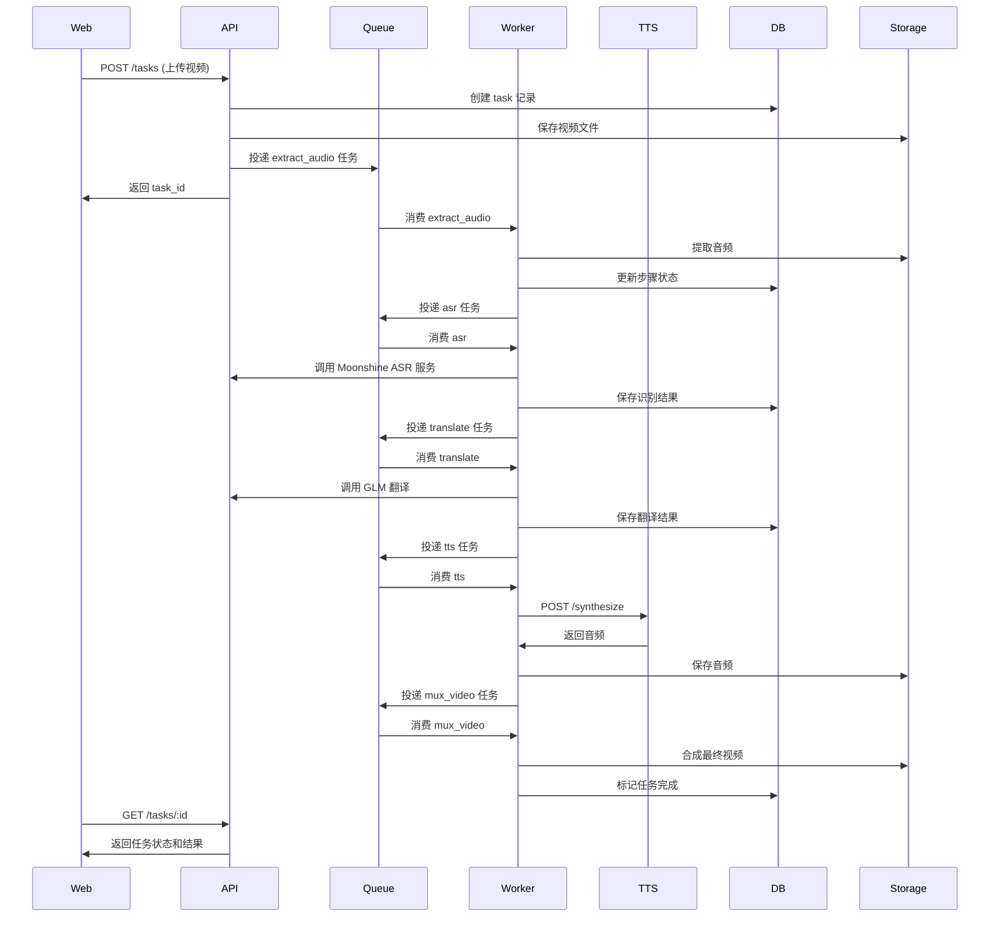

# 系统架构设计文档

## 1. 服务边界与队列选型

### 1.1 队列选型：RabbitMQ

**选择理由：**
- 支持复杂的路由规则（routing key、exchange、queue binding）
- 内置死信队列（DLQ）和延迟重试机制
- 消息持久化保证可靠性
- 适合任务依赖链式处理
- 社区成熟，文档丰富

**替代方案 NATS 的劣势：**
- 路由能力相对简单，不适合复杂的任务编排
- 延迟队列需要额外实现

### 1.2 服务边界划分

#### 1.2.1 API 服务（api/）
**职责：**
- 对外提供 REST API
- 接收文件上传
- 创建任务记录
- 查询任务状态和结果
- 提供下载链接

**技术栈：** Go + Gin/Echo

#### 1.2.2 编排服务（orchestrator/）
**决策：与 API 服务合并，但以独立包存在**

**现状与职责边界：**
- `api/internal/orchestrator` 暴露 `TaskOrchestrator`、`QueuePublisher`、`TaskRepository` 接口，默认实现 `DefaultTaskOrchestrator`
- API 层只负责入参校验、文件上传、持久化初始任务记录，再通过接口调用 orchestrator 启动状态机
- Orchestrator 负责任务状态机入口、步骤依赖与消息投递（当前第一跳为 `extract_audio`），并通过 `TaskRepository` 更新任务状态
- 通过接口解耦后，可将 orchestrator 抽离为独立进程或扩展更多状态（重试、暂停、取消）而无需修改 API handler

**后续可拆分路径：**
- 替换 `QueuePublisher` 实现为 RPC/HTTP 客户端，将编排逻辑迁移到独立服务
- 扩展 `TaskRepository` 接口以支持乐观锁、审计日志等高级特性

#### 1.2.3 Worker 服务（worker/）
**职责：**
- 消费队列任务
- 执行具体处理步骤
- 更新任务状态和进度
- 处理失败重试

**步骤拆分粒度：**
- `extract_audio`: 提取音频（ffmpeg）
- `asr`: 语音识别（Moonshine ASR 服务）
- `translate`: 机器翻译（GLM API）
- `tts`: 语音合成（调用 tts_service）
- `mux_video`: 视频合成（ffmpeg）

**技术栈：** Go + RabbitMQ client

#### 1.2.4 TTS 服务（tts_service/）
**职责：**
- 通过 ModelScope API 调用 IndexTTS-2 模型进行语音合成
- 接收文本和时间轴约束参数
- 返回合成音频
- 作为适配层，封装 ModelScope API 调用细节

**技术栈：** Python + FastAPI + uv + ModelScope SDK

### 1.3 服务通信方式

```
┌─────────┐      HTTP/REST      ┌─────────┐
│   Web   │ ───────────────────> │   API   │
└─────────┘                      └────┬────┘
                                      │
                                      │ RabbitMQ
                                      │ (任务队列)
                                      │
                              ┌───────▼───────┐
                              │    Worker     │
                              └───────┬───────┘
                                      │
                                      │ HTTP
                                      │
                              ┌───────▼───────┐
                              │ TTS Service   │
                              └───────────────┘
```

## 2. 数据流设计

### 2.1 任务处理流程


