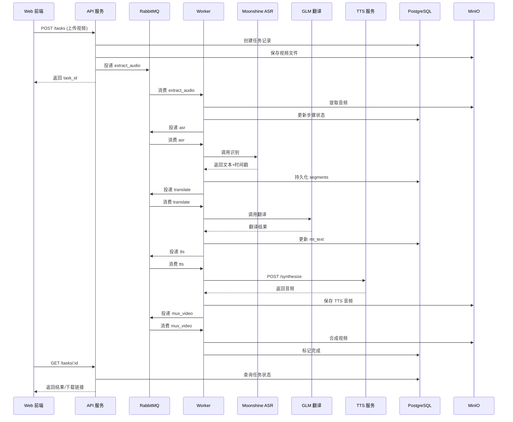

# 系统架构设计文档

> 更新日期：2026-01-03｜适用版本：main 分支

本文件阐述视频本地化自动配音系统的核心架构、服务边界与任务处理流程。补充图示（整体架构、数据流、部署拓扑、状态机）请参见 `architecture-diagram.md`。

## 1. 架构概览

- **模式**：微服务 + 异步任务队列
- **语言与框架**：Go（API/Worker），Python（TTS），FastAPI + uv（TTS 服务），RabbitMQ（消息队列），PostgreSQL + MinIO（数据与对象存储）
- **部署**：Docker Compose 编排，可横向扩展 Worker 实例

## 2. 服务边界与职责

### 2.1 API 服务（`api/`）
- 提供 REST API（上传、任务查询、下载）
- 管理任务状态机与编排逻辑（创建任务、投递队列、记录依赖）
- 负责鉴权与基础输入校验

### 2.2 Worker 服务（`worker/`）
- 消费 RabbitMQ 队列，执行离线/异步任务
- 典型步骤：`extract_audio` → `asr` → `translate` → `tts` → `mux_video`
- 负责步骤级重试、失败回退与进度上报

### 2.3 TTS 服务（`tts_service/`）
- 通过 ModelScope API 调用 IndexTTS-2 进行受时间轴约束的语音合成
- 返回合成音频并写入对象存储

### 2.4 基础设施
- **RabbitMQ**：任务编排与重试；支持 routing key / DLQ
- **PostgreSQL**：任务、分段、审计记录
- **MinIO**：输入、阶段产物与最终结果的对象存储
- **NGINX**：统一入口，转发 API/TTS/前端静态资源

## 3. 队列选型（RabbitMQ）

- 路由能力丰富，适合多步骤任务链
- 内置 DLQ/延迟重试，可靠性高
- 成熟度与生态完善，便于运维与监控

## 4. 任务处理流程（文字版 + 单一示意图）

### 4.1 文字流程
1. Web 前端调用 **API** 上传视频，创建任务记录并落盘至 MinIO。
2. API 将 `extract_audio` 任务投递到 **RabbitMQ**。
3. **Worker** 提取音频、更新数据库并投递下一步 `asr`。
4. Worker 调用 **Moonshine ASR 服务** 完成识别，保存分段与时间戳。
5. Worker 调用 **GLM 翻译 API**，写入翻译结果并投递 `tts`。
6. Worker 调用 **TTS 服务** 合成目标语音，写入 MinIO。
7. Worker 执行 `mux_video`，合成最终视频并更新任务状态为完成。
8. Web 前端轮询任务状态或获取下载链接。

### 4.2 任务流程示意图

## 5. 数据与安全要点

- **存储分层**：视频/音频等二进制存 MinIO，任务元数据与审计存 PostgreSQL。
- **鉴权与密钥**：MVP 阶段可存储明文 API Key；生产环境建议接入密钥管理或加密字段。
- **网络隔离**：通过 Docker 网络隔离内部服务，仅暴露必要端口（NGINX/API/TTS/管理面板）。
- **可观察性**：优先在 API 与 Worker 侧暴露统一的健康检查；RabbitMQ/MinIO/PostgreSQL 使用自带管理界面。

## 6. 扩展与弹性

- Worker 可通过 `docker compose up -d --scale worker=N` 横向扩容。
- RabbitMQ 与存储可迁移到托管方案以提升可靠性。
- TTS/ASR 可替换为其他模型服务，保持 API/Worker 契约稳定。

## 7. 补充图示

更多可视化（整体架构图、数据流、部署拓扑、任务状态机）见 [`architecture-diagram.md`](architecture-diagram.md)。
